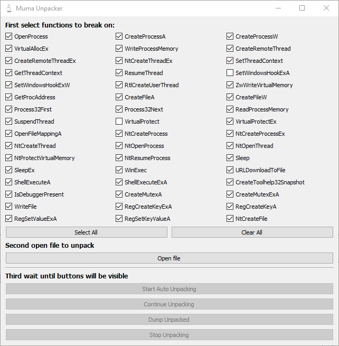
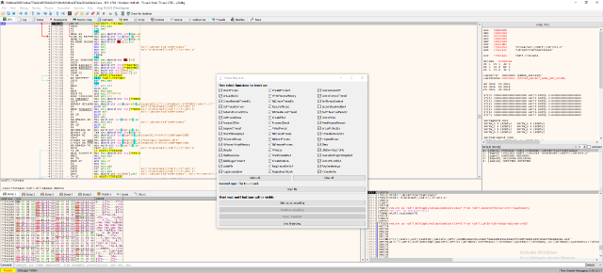
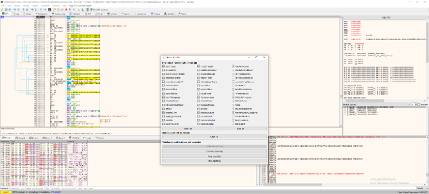
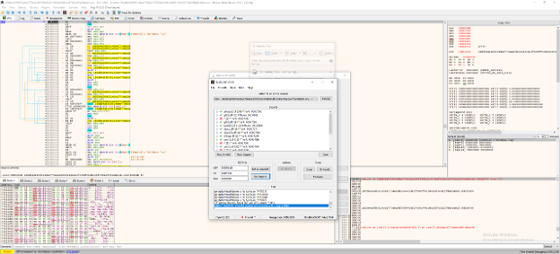

# MumaUnpacker

[](https://isocpp.org/)
[](https://x64dbg.com/)
[](https://www.qt.io/)
[](LICENSE)
[]()

**MumaUnpacker** is an [x64dbg](https://x64dbg.com/) plugin that automates dynamic unpacking of packed malware. The plugin sets breakpoints on a curated list of potentially dangerous Windows API functions, hides the debugger from simple anti-debug checks, and hands the unpacked image off to Scylla for a clean dump with valid OEP and IAT.

## Features

- Automatic breakpoint placement on ~45 potentially dangerous Windows API functions (`OpenProcess`, `VirtualAllocEx`, `WriteProcessMemory`, `CreateRemoteThread`, `NtCreateFile`, and more).
- Dynamic breakpoint installation when a module is loaded late (`CB_LOADDLL` handler) — covers malware that loads DLLs on the fly.
- Debugger concealment via the built-in x64dbg `hide` command — defeats simple anti-debug checks.
- GUI with per-function checkboxes and **Select All** / **Clear All** buttons.
- Automatic OEP hand-off to **Scylla** — no manual address entry required.
- Two builds: **x86** (`/artifacts/MumaUnpacker.dp32`) for x32dbg and **x64** (`/artifacts/MumaUnpacker.dp64`) for x64dbg.

## How It Works

Unpacking model:

```
Sample acquisition → Environment init → Sample launch
       ↓
Wait for a call to an API from the "dangerous" list
       ↓
Sample halt → Memory dump
```

Core idea: any malware, once unpacked, must call Windows APIs. By intercepting calls to a pre-selected list of dangerous functions, we can reliably detect the moment when the payload is unpacked and ready to dump.

The plugin registers the following x64dbg callbacks:

- `CB_SYSTEMBREAKPOINT` — install breakpoints before the target starts executing.
- `CB_BREAKPOINT` — halt and handle a hit.
- `CB_LOADDLL` — install breakpoints on functions of freshly loaded libraries.
- `CB_INITDEBUG` / `CB_STOPDEBUG` — manage UI state.

## Supported Packers

| Packer | Result |
|---|---|
| UPX | ✅ Unpacked |
| Custom / in-house packers | ✅ Unpacked |
| Generic (UPX-like) | ✅ Unpacked |
| Anothers | 🔎 (you can try) |

Commercial protectors with active anti-debug require additional countermeasures (e.g. ScyllaHide) — see *Roadmap*.

## Installation

1. Download the prebuilt plugin from the [Artifacts](./artifacts) directory:
   - `MumaUnpacker.dp32` — for **x32dbg**
   - `MumaUnpacker.dp64` — for **x64dbg**
2. Place the file into the `plugins\` subfolder next to the debugger executable:
   ```
   x64dbg\release\x64\plugins\MumaUnpacker.dp64
   x64dbg\release\x32\plugins\MumaUnpacker.dp32
   ```
3. Start the debugger. The **Log** window should show:
   ```
   [PLUGIN] MumaUnpacker v1 Loaded!
   ```

## Usage

> ⚠️ **Warning!** Never run malware samples on your host OS. Always use an isolated VM without network access and with antivirus disabled.

1. Open the **Muma Unpacker** tab (it appears automatically when the plugin loads).

   

2. In the top section, tick the checkboxes for the APIs you want to monitor. The default set is recommended.

   

3. Click **Open file** and pick the target `.exe` / `.dll` / `.sys`. A malware warning will pop up. Once initialized, the following buttons become active:
   - **Start Auto Unpacking** — begin automatic unpacking.
   - **Continue Unpacking** — resume if automation stopped early.
   - **Dump Unpacked** — invoke Scylla to save the unpacked image.
   - **Stop Unpacking** — halt debugging.

   

4. After clicking **Dump Unpacked**, Scylla opens with the OEP already filled in. Choose an output directory and save the file.

   

## Building from Source

### Requirements

- **Visual Studio 2022** (Desktop development with C++)
- **CMake** ≥ 3.20
- **Qt 5.12.12** (compatible with current x64dbg releases)
- **`cmkr`** — CMake wrapper (fetched automatically on first configure)

### x64 build

```bash
cmake -B build64 -A x64
cmake --build build64 --config Release
```

### x86 build

```bash
cmake -B build32 -A Win32
cmake --build build32 --config Release
```

Outputs:

```
build64\Release\MumaUnpacker.dp64
build32\Release\MumaUnpacker.dp32
```

You can also open the Visual Studio solutions directly via `build64\PluginTemplate.slnx` and `build32\PluginTemplate.slnx`.

## Repository Structure

```
MumaUnpacker/
├── src/                      Plugin source (shared between x86/x64)
│   ├── plugin.cpp / .h       Entry point, callback registration, API list
│   ├── pluginmain.cpp / .h
│   ├── CbHandlers.cpp / .h   x64dbg event handlers
│   ├── BreakpointsHandlers.* Breakpoint management
│   ├── MumaUnpackerWidget.*  Qt-based GUI
│   ├── resources.qrc
│   └── icon.png
├── build32/                  VS solution for x86 
├── build64/                  VS solution for x64
├── artifacts/                Prebuilt binaries .dp32 / .dp64
└── README.md
```

## Test Results

Test bench: Windows 10 x64 Enterprise LTSC 2021 in VMware Workstation 17 Pro, Windows Defender disabled via Group Policy.

Dataset: 30 packed malware samples (tag `packed`) from [MalwareBazaar](https://bazaar.abase.ch/), classified by packer type using [Detect It Easy](https://github.com/horsicq/Detect-It-Easy).

| Packer | Manual unpacking | MumaUnpacker |
|---|---|---|
| Generic (UPX-like) | 27 s | **17 s** |
| UPX 3.96 [LZMA] | 30 s | **20 s** |
| Custom (one case) | > 300 s | much faster |

The goal — reducing unpacking time during malware analysis — was achieved.

## Roadmap

- Integrate **ScyllaHide** or custom anti-anti-debug mechanisms to defeat commercial protectors (VMProtect, Themida).
- Automatic skipping of delays (`Sleep`, `SleepEx`, timers) used by malware to stall unpacking.
- Heuristic selection of breakpoint targets based on API call sequences.
- GUI improvements: real-time display of the triggering function and its arguments.

## Author

**Ivan Tushkevich** — [@tushkeviv](https://github.com/tushkeviv)

Developed as part of a bachelor's thesis. The full thesis text (methodology, analysis of existing solutions — Renovo, PolyUnpack, OmniUnpack, Pinicorn — and a bibliography) is available in the original document.

## License

Released under the **MIT License**. See [LICENSE](LICENSE).

## Acknowledgements

- The [x64dbg](https://github.com/x64dbg/x64dbg) team for the debugger and SDK.
- The [PluginTemplate](https://github.com/x64dbg/PluginTemplate) boilerplate.
- The [Scylla](https://github.com/NtQuery/Scylla) author for the dumper.